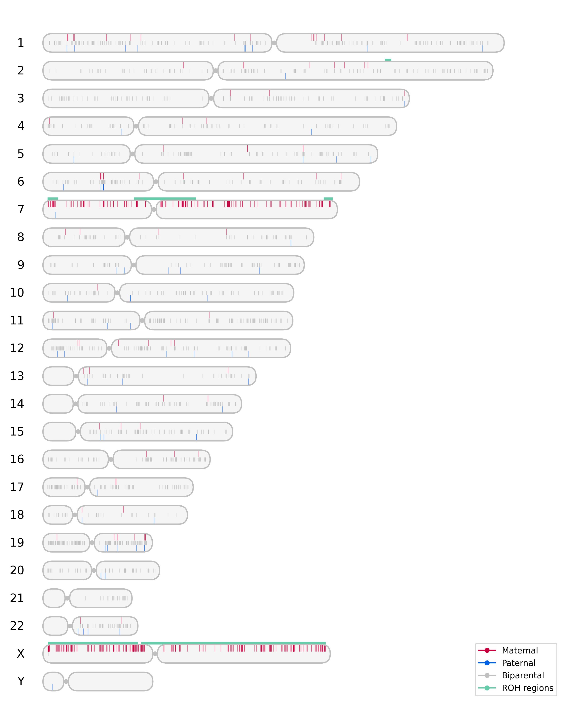
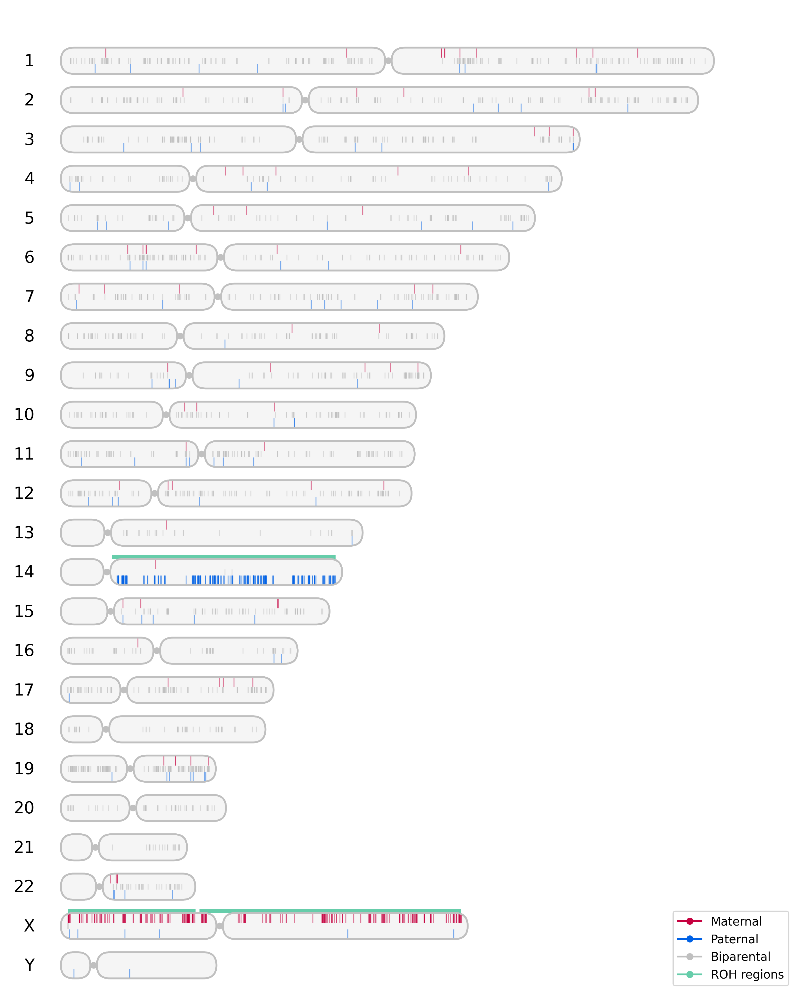
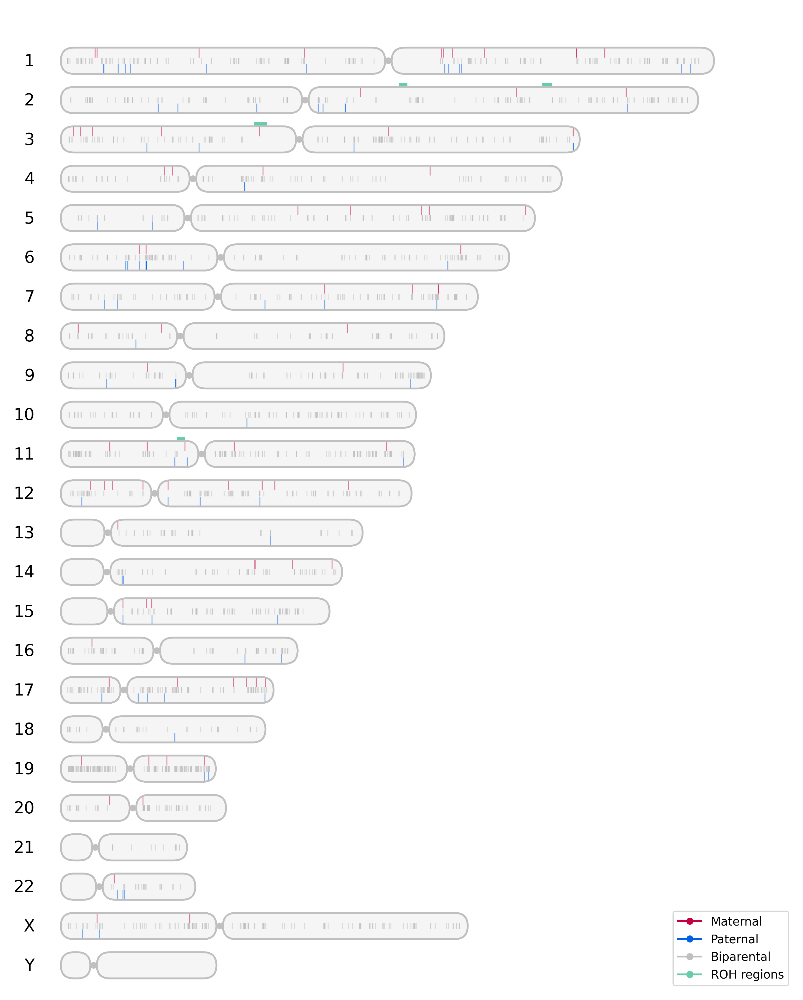
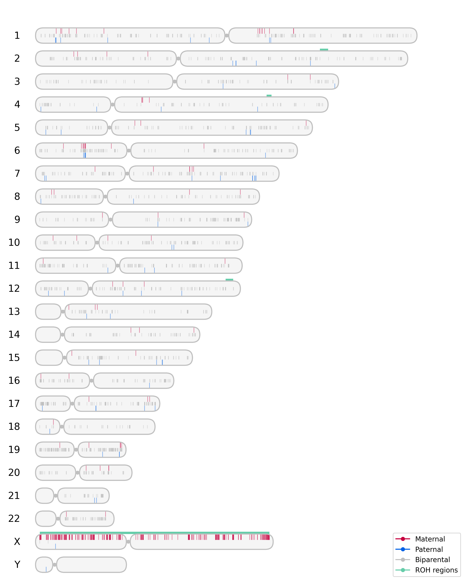

# UPDgraph

UPDgraph is a tool for detecting Uniparental Disomies (UPDs) from trio exome or genome VCF files. The tool generates ideogram plots representing the parental origin of single nucleotide variants along with Runs of Homozygosity (ROH), enabling easy and visual detection of UPDs.

## Overview & Features

UPDgraph operates as follows:

- Extracts the trio (child, father, mother) from a multi-sample VCF/BCF file based on a PED file
- Uses BCFtools to sort variants based on their inheritance pattern
- Runs AutoMap to identify ROH (for hg19/hg38 genomes only)
- Generates comprehensive ideogram plots combining all the information


## Installation

UPDgraph can be installed and run in three different ways:

### Option 1: Using Singularity (Recommended)

```bash
# Clone the repository
git clone https://github.com/Fred-07/UPDgraph.git
cd UPDgraph

# Build the Singularity container
singularity build UPDgraph.sif UPDgraph_singularity.def

# Run UPDgraph using Singularity
singularity exec -B $PWD UPDgraph.sif bash UPDgraph.sh --vcf ./data/trio.vcf.gz -p ./data/family.ped -g hg19 -o output.png
```

### Option 2: Using Docker

```bash
# Clone the repository
git clone https://github.com/Fred-07/UPDgraph.git
cd UPDgraph

# Build the Docker container
docker build -t updgraph .

# Run UPDgraph using Docker
docker run -v $(pwd):/data updgraph bash UPDgraph.sh --vcf ./data/trio.vcf.gz -p ./data/family.ped -g hg19 -o output.png
```


```bash
### Option 3: Local Installation
Prerequisites:
- Python 3+ with classic libraries: matplotlib, argparse
- BCFtools (v1.13+)
- AutoMap Fork (https://github.com/Fred-07/AutoMap)
	- BEDTools (v2.30.0+)
	- R (v3.5+)
	- Perl (v5.22+)

# Clone the repository
git clone https://github.com/Fred-07/UPDgraph.git

# Clone AutoMap if not already installed
git clone https://github.com/Fred-07/AutoMap.git

# Run UPDgraph locally
bash ./UPDgraph/UPDgraph.sh --vcf ./UPDgraph/data/trio.vcf.gz -p ./UPDgraph/data/family.ped -g hg19 -a ./AutoMap/ -u ./UPDgraph/ -o output.png 
```

**Note**: For local installation, specify the path to AutoMap (-a) and UPDgraph (-u) in the command.


## Usage

Regardless of the installation method, UPDgraph is used with the same command structure:

```bash
bash UPDgraph.sh --vcf <vcf_file> -p <pedfile> -g <genome> -o <output_file> [options]
```

### Required Arguments:
- `--vcf`: Path to the multi-sample VCF file
- `-p, --pedfile`: Path to PED file containing family information (single line)
- `-g, --genome`: Human genome version (hg19, hg38, or T2T)
- `-o, --output`: Filename for the output PNG file (default: 'plot.png')

### Optional Arguments:
- `-v, --verbose`: Verbosity level from 1 (low) to 3 (high) (default: 1)
- `-n, --naming_chr`: Specify a prefix for chromosome naming in the plot (e.g., 'chr') (default: '')
- `-r, --readdepth`: Minimum read depth to consider a position (default: 8)
- `-k, --overwritefiles`: Overwrite existing files created previously with UPDgraph (yes/no) (default: 'yes')
- `-m, --keeptemporaryfiles`: Keep temporary files created with UPDgraph (yes/no) (default: 'yes')
- `-t, --threads`: Number of threads to use with bcftools (default: 1)
- `-u, --UPDgraph_py_HOME`: Specify the path for UPDgraph.py (default: '/opt/UPDgraph/')
- `-a, --AUTOMAP_HOME`: Specify the path for automap_vx.x.x.sh (default: '/opt/AutoMap/')
- `-y, --show_chrY`: Plot chromosome Y (yes/no) (default: 'yes')


## Input Files

### VCF Requirements
- Multi-sample VCF/BCF file containing the trio (child, father, mother)
- Samples must correspond to the names specified in the PED file
- VCF should be indexed (`.tbi` or `.csi` index file)

### PED File Format

The PED file should contain a single line with 6 tab-separated fields:
```
FamilyID  IndividualID  FatherID  MotherID  Sex  DiseaseStatus
```

### Test Data Setup

For testing purposes, you can use the GIAB (Genome in a Bottle) Chinese Trio dataset. Follow these steps to download and prepare the test data:

```bash
# Download and Merge the three VCF files into a single multi-sample VCF

wget https://ftp-trace.ncbi.nlm.nih.gov/ReferenceSamples/giab/release/ChineseTrio/HG005_NA24631_son/latest/GRCh37/HG005_GRCh37_1_22_v4.2.1_benchmark.vcf.gz
wget https://ftp-trace.ncbi.nlm.nih.gov/ReferenceSamples/giab/release/ChineseTrio/HG005_NA24631_son/latest/GRCh37/HG005_GRCh37_1_22_v4.2.1_benchmark.vcf.gz.tbi

wget https://ftp-trace.ncbi.nlm.nih.gov/ReferenceSamples/giab/release/ChineseTrio/HG006_NA24694_father/latest/GRCh37/HG006_GRCh37_1_22_v4.2.1_benchmark.vcf.gz
wget https://ftp-trace.ncbi.nlm.nih.gov/ReferenceSamples/giab/release/ChineseTrio/HG006_NA24694_father/latest/GRCh37/HG006_GRCh37_1_22_v4.2.1_benchmark.vcf.gz.tbi

wget https://ftp-trace.ncbi.nlm.nih.gov/ReferenceSamples/giab/release/ChineseTrio/HG007_NA24695_mother/latest/GRCh37/HG007_GRCh37_1_22_v4.2.1_benchmark.vcf.gz
wget https://ftp-trace.ncbi.nlm.nih.gov/ReferenceSamples/giab/release/ChineseTrio/HG007_NA24695_mother/latest/GRCh37/HG007_GRCh37_1_22_v4.2.1_benchmark.vcf.gz.tbi

singularity exec -B $PWD UPDgraph.sif bcftools merge \
  HG005_GRCh37_1_22_v4.2.1_benchmark.vcf.gz \
  HG006_GRCh37_1_22_v4.2.1_benchmark.vcf.gz \
  HG007_GRCh37_1_22_v4.2.1_benchmark.vcf.gz \
  -O z -o ./data/trio.vcf.gz

singularity exec -B $PWD UPDgraph.sif bcftools index -t ./data/trio.vcf.gz
```
**Ped file for the GIAB Chinese Trio:**
```
FAM1	HG005	HG006	HG007	1	2
```

After setup, your `data` directory should contain:
```
./data/
├── trio.vcf.gz
├── trio.vcf.gz.tbi
└── family.ped
```


## Output and Interpretation

UPDgraph generates an ideogram plot file with the specified output name showing:
- Parental origin of variants across chromosomes (color-coded):
  - **Red**: Maternal origin
  - **Blue**: Paternal origin
  - **Gray**: Biparental (inherited from both parents)
- ROH regions (if using hg19 or hg38 genome references) shown in green boxes above the chromosomes

### Interpreting Results

#### Interpreting Autosomes

- **Maternal UPD**: Predominance of red markers across an entire chromosome or a segment
- **Paternal UPD**: Predominance of blue markers across an entire chromosome or a segment
- **Isodisomy**: UPD coinciding with ROH (green boxes)
- **Heterodisomy**: UPD without ROH

#### Interpreting Sex Chromosomes

- **Normal Female (XX)**: Mixture of gray (biparental), blue (paternal), and red (maternal) markers
- **Normal Male (XY)**: Predominantly red (maternal) markers since males inherit X from mother only
- **Abnormal Patterns**:
  - Female with predominantly or exclusively paternal X markers: Could indicate complete maternal X loss
  - Female with predominantly maternal X markers: May indicate paternal X chromosome loss
  - Male with blue (paternal) markers on X: Indicates abnormal X inheritance pattern

### Examples

#### Maternal UPD on chromosome 7 in a male patient

#### Paternal UPD on chromosome 14 in a male patient


#### Normal Female


#### Normal Male



## License & Contact
- This project is licensed under the [GPL-3.0 license](https://www.gnu.org/licenses/gpl-3.0.enG.html) - see the LICENSE file for details.

- GitHub Issues: https://github.com/Fred-07/UPDgraph/issues